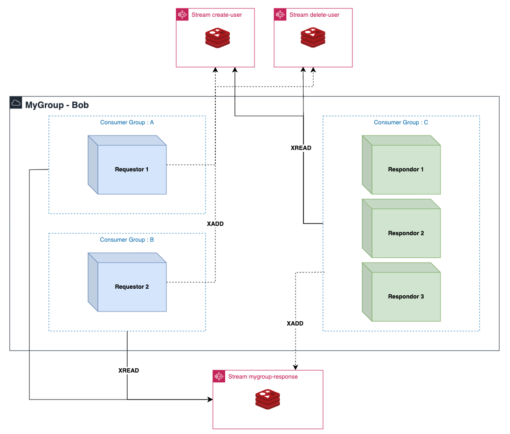

<p align="center">
  <a href="http://nestjs.com/" target="blank">
    
  </a>

</p>

<h3 align="center">
  Redis Streams Transport Strategy for <a href="http://nestjs.com/">NestJS</a> using <a href="https://github.com/luin/ioredis">ioredis</a> library.
</h3>

<div style="display: flex; justify-content: center;">

    

</div>

<!-- @import "[TOC]" {cmd="toc" depthFrom=1 depthTo=6 orderedList=false} -->

<!-- code_chunk_output -->

- [Installation](#installation)
- [Introduce](#introduce)
    - [NestJs Basic Redis Pub/Sub transporter Problems](#nestjs-basic-redis-pubsub-transporter-problems)
    - [What I wanted to improve from the library I referenced](#what-i-wanted-to-improve-from-the-libraryhttpsgithubcomtamimajnestjs-redis-streams-i-referenced)
  - [Structure & Concept](#structure--concept)
- [Usage](#usage)
  - [Client Mode (Requestor App)](#client-mode-requestor-app)
    - [(1) Register the client provider](#1-register-the-client-provider)
    - [(2) Enable `shutDownHook` in `main.ts`](#2-enable-shutdownhook-in-maints)
    - [(3) Send the message to the server using the client](#3-send-the-message-to-the-server-using-the-client)
      - [(3-1) Fire And Forgot](#3-1-fire-and-forgot)
      - [(3-2) Send a message and get a response](#3-2-send-a-message-and-get-a-response)
  - [Server Mode (Receiver App)](#server-mode-receiver-app)
    - [(1) Enable `shutDownHook` in `main.ts` and `Transport Strategy`](#1-enable-shutdownhook-in-maints-and-transport-strategy)
    - [(2) Handle the messages comming from a Requestor](#2-handle-the-messages-comming-from-a-requestor)
- [Test](#test)
  - [Unit Test](#unit-test)
  - [E2E Test](#e2e-test)
    - [Set Up](#set-up)
    - [Start e2e Test](#start-e2e-test)
- [Stay in touch](#stay-in-touch)
- [License](#license)

<!-- /code_chunk_output -->

<br/>

# Installation

```shell
## npm
npm install --save nestjs-redis-stream-microservice
yarn add nestjs-redis-stream-microservice
```

> **Note**: The library was developed based on the [nestjs-redis-streams](https://github.com/tamimaj/nestjs-redis-streams) package.

<br/>

# Introduce

### NestJs Basic Redis Pub/Sub transporter Problems

> **SEE** : https://github.com/nestjs/nest/issues/3960

- The [official Redis Transporter](https://docs.nestjs.com/microservices/redis) provided by NestJs is implemented based on Redis PUB/SUB and is **not suitable for use when the SUB server is a distributed system**.
- We implemented a redis-stream based Custom Transporter to ensure that messages are not duplicated and that messages are received or not.

<br/>

### What I wanted to improve from the [library](https://github.com/tamimaj/nestjs-redis-streams) I referenced

- Inconvenience of **having to format response data**
- Message handler must be configured with the specified decorator
- User needs to know **technical concepts** for setting up **redis-stream**

<br/>

## Structure & Concept


The library implements the NestJs Custom Transporter, which can be used in a NestJs-based MSA distributed environment.

- **Server Mode Support**
  - server mode is the mode used by the Responder server on the right side of the image.
  - mode used when processing requests from requesters and configuring responses and returning them.
  - e.g. nestjs Micro Service App
- **Client Mode Support**
  - client mode is the mode used by the requester server on the left side of the image.
  - You can configure and send a message to the responder, receive a response, or forget it after sending (Fire&Forgot);
  - e.g. nestjs API Gateway App or other Micro Service App

Basically, it is designed to leverage Redis Stream capabilities to implement the Custom Transporter interface provided by Nestjs.

<br/>

# Usage

## Client Mode (Requestor App)

### (1) Register the client provider

```typescript
// each module that you want to send a message to
@Module({
  providers: [
    {
      provide: 'REDIS-STREAM-CLIENT',
      useFactory: () => {
        return new RedisStreamClient({
          connection: {
            host: '127.0.0.1',
            port: 6388,
            password: 'beobwoo',
          },
        });
      },
    },
  ],
})
export class UserModule {}
```

> **Note** : When using client mode, it will be modified so that it can only be registered once in the root module globally.

- If necessary, you can register **using environment variables** according to the [nestjs Factory Provider registration](https://docs.nestjs.com/fundamentals/custom-providers) method.

### (2) Enable `shutDownHook` in `main.ts`

```typescript
// main.ts
async function bootstrap() {
  const app = await NestFactory.create(AppModule);
  // NOTE : ShutDownHook must be enabled to automatically delete the consumer of redis-stream.
  // If you do not enable it, you must manually delete the consumer in the redis-stream.
  app.enableShutdownHooks();
  await app.listen(3000);
}
```

- To avoid wasting Redis resources, it includes the ability to **automatically clean up unnecessary Redis Stream resources upon server shutdown**.
- You must enable [enableShutdownHooks](https://docs.nestjs.com/fundamentals/lifecycle-events#application-shutdown) to ensure that the resource cleanup function works correctly.

### (3) Send the message to the server using the client

```typescript
// your service or controller
import { ClientProxy } from '@nestjs/microservices';

constructor(
  @Inject('REDIS-STREAM-CLIENT')
  private readonly client: ClientProxy,
) {}
```

If you received the client instance that you registered in course 1, you can use the client instance to send a message to the server. Depending on the purpose, the message can be sent in two ways.

#### (3-1) Fire And Forgot

> **Note** : Emit a message without waiting for a response

```typescript
@Controller()
export class Requestor1Controller {
  constructor(
    @Inject('REDIS-STREAM-CLIENT')
    private readonly client: ClientProxy,
  ) {}

  @Post()
  emit() {
    this.clientProxy.emit('stream:name:hear', data);
    return 'Emit Success';
  }
}
```

#### (3-2) Send a message and get a response

```typescript
@Controller()
export class Requestor1Controller {
  constructor(
    @Inject('REDIS-STREAM-CLIENT')
    private readonly client: ClientProxy,
  ) {}

  @Post()
  send() {
    const response$ = this.clientProxy.send('stream:name:hear', data);
    const response = await lastValueFrom(observable); // get the last value from the observable
    return JSON.stringify(response);
  }
}
```

- Internally, it generates its **own response stream**.
- Even if the server that sent the request is deployed, the response is returned only to the exact server that sent the request.
  > **Note** : use uuid v4 to identify the requester and cause extremely low probability of collision.

<br/>

## Server Mode (Receiver App)

### (1) Enable `shutDownHook` in `main.ts` and `Transport Strategy`

```typescript
// main.ts
async function bootstrap() {
  const app = await NestFactory.create(Responder1Module);

  app.connectMicroservice({
    strategy: new RedisStreamServer({
      connection: {
        host: '127.0.0.1',
        port: 6388,
        password: 'beobwoo',
      },
      option: {
        // The logical group that wants to receive the message.
        // NOTE : Give the same group name if it is a distributed server with the same functionality
        consumerGroup: 'my-server',
      },
    }),
  });
  // NOTE : ShutDownHook must be enabled to automatically delete the consumer of redis-stream.
  // If you do not enable it, you must manually delete the consumer in the redis-stream.
  app.enableShutdownHooks();

  await app.startAllMicroservices();
  await app.listen(3080);
}
bootstrap();
```

### (2) Handle the messages comming from a Requestor

```typescript
@Controller()
export class WelcomeEmailController {
  @MessagePattern('stream-1')
  async returnObservable(@Payload() data: any) {
    return of([1, 2, 3]);
  }

  @MessagePattern('stream-2')
  async returnObject(@Payload() data: any) {
    return {
      status: 'good',
    };
  }

  @MessagePattern('stream-3')
  async returnPrimitiveType(@Payload() data: any) {
    return true;
  }
}
```

> **Note** : The feature to get request metadata using `@Ctx()` will be added in the **next version**.

- Return data configurations are designed to support return of response data configurations in all possible ways, including `Observable`, `Object`, and `Primary type`, to free themselves without a fixed format.

<br/>

# Test

The entire [git project](https://github.com/KIMBEOBWOO/nestjs-redis-stream-microservice/tree/master) includes an `e2e` test set to verify normal behavior in a distributed environment.
The following procedures must be followed to run the test.

> **Note** : Don't worry! The npm package only has a necessary source code.

## Unit Test

```bash
yarn test
```

## E2E Test

### Set Up

```bash
yarn test:set-up

# start Requestor 1
yarn start:dev requestor-1
# start Requestor 2
yarn start:dev requestor-2
# start Responder 1
yarn start:dev responder-1
# start Responder 2
yarn start:dev responder-2
```

### Start e2e Test

```bash
yarn test:e2e
```

<br/>

# Stay in touch

Author/Developer - [KIMBEOBWOO](https://github.com/KIMBEOBWOO)

# License

Nest is [MIT licensed](LICENSE).
